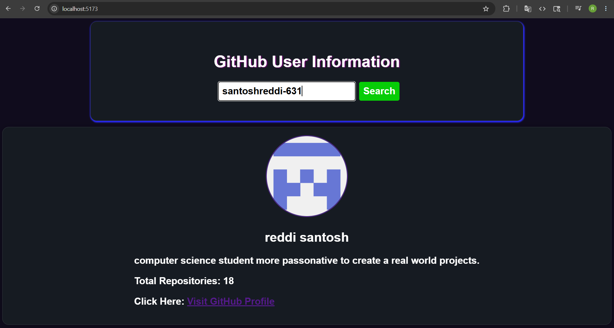

# GitHub User Information App

A simple and modern React application that fetches GitHub user details using the GitHub REST API. Users can search any GitHub username and view profile information such as avatar, bio, followers, repositories, and profile link.

---

## 🚀 Features

* 🔍 Search GitHub users by username
* 👤 Display user profile information
* 🖼️ User avatar preview
* 📦 Public repositories count
* 👥 Followers & following count
* 🌐 Direct GitHub profile link
* ⚡ Fast API fetching using Fetch API
* 🎨 Modern responsive UI
* 🔐 Secure GitHub token using `.env`

---

## 🛠️ Technologies Used

* React.js
* JavaScript
* CSS3
* GitHub REST API
* Vite

---

## 📸 Preview

Add your project screenshot here.

```md id="3a9gql"


```

---

## 📂 Project Structure

```bash id="v6q8nh"
github-api/
│
├── public/
├── src/
│   ├── components/
│   ├── Github_API.jsx
│   ├── App.jsx
│   ├── main.jsx
│   └── index.css
│
├── .env
├── package.json
└── README.md
```

---

## ⚙️ Installation

Clone the repository:

```bash id="k9i8zj"
git clone https://github.com/your-username/github-api.git
```

Navigate to the project folder:

```bash id="x56c0u"
cd github-api
```

Install dependencies:

```bash id="v4kh5f"
npm install
```

Start the development server:

```bash id="2fw9qb"
npm run dev
```

---

## 🔑 Environment Variables

Create a `.env` file in the root directory:

```env id="z41wlg"
VITE_GITHUB_TOKEN=your_github_token
```

Generate your GitHub token from:

[GitHub Personal Access Tokens](https://github.com/settings/tokens?utm_source=chatgpt.com)

---

## 📡 GitHub API Endpoint Used

```bash id="8n3v5h"
https://api.github.com/users/{username}
```

Official Documentation:

[GitHub Users API Docs](https://docs.github.com/en/rest/users/users?utm_source=chatgpt.com#get-a-user)

---

## 💻 Example API Response

```json id="w8k5ec"
{
  "login": "octocat",
  "name": "The Octocat",
  "bio": "GitHub mascot",
  "public_repos": 8,
  "followers": 100,
  "following": 10
}
```

---

## ✨ Future Improvements

* Repository list section
* Dark / Light mode
* Loading animations
* Error handling improvements
* Mobile responsiveness
* Search history
* User contribution graph

---

## 📚 What I Learned

* React Hooks (`useState`)
* API fetching with `fetch`
* Async/Await
* Environment variables in Vite
* Conditional rendering
* Handling loading and error states

---

## 🤝 Contributing

Contributions are welcome.

Fork the repository and create a pull request.

---

## 📜 License

This project is open source and available under the MIT License.

---

## 👨‍💻 Author

**Santosh Reddi**

* GitHub: [Santoshreddi-631 GitHub Profile](https://github.com/santoshreddi-631)
